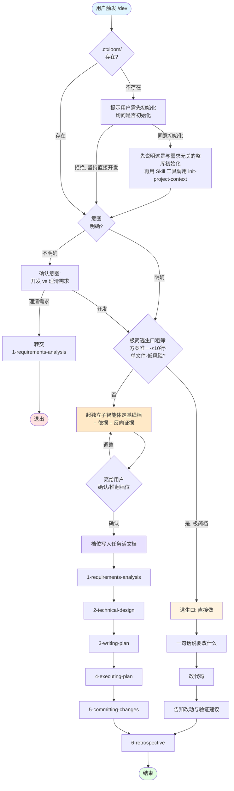

# 开发任务入口

本技能是所有功能开发的入口。它的使命：**让任务默认走完整流程，再按复杂度调节每一步的深浅，而不是靠跳过步骤来省事**。

设计取舍：这套技能的核心价值，就在于"需求→设计→计划→执行→提交→复盘"这条完整流程能把功能想清楚、做扎实。所以默认就走完整流程——简单任务也走，只是每步轻量带过；复杂任务也走，每步充分展开。**减负靠的是"每步缩放"，不是"整段跳过"**——这样哪怕复杂度判轻了，最坏也只是某一步做薄了，而不是整条流程被抽掉。唯一的例外是极琐碎的改动（改错别字、调一个常量这类），不值得为它启动整条流程，走逃生口直接做。

## 整体流程图

> 图中 `1→2→3→4→5→6` 这条主链对**标准档和深度档都一样要全走**，差别只在每一步内部的深浅——由各步技能自带的「简繁自适应」节按活文档里的基线档缩放。极简档是唯一不进主链、直接交付的逃生口。

> **调用技能时的名字规范（重要）：** 本文中提到的 `init-project-context`、`1-requirements-analysis` … `6-retrospective` 都是 `ctxloom` 插件下的技能。用 Skill 工具调用它们时，**必须传完整限定名 `ctxloom:<技能名>`，原样照抄、不要剥掉前缀也不要自行拼凑**。注意两类技能名形态不同：`init-project-context` **无数字前缀**（它是一次性的全局地基，不属于 1–6 流程链），调用名就是 `ctxloom:init-project-context`；`1-requirements-analysis` 到 `6-retrospective` **带数字前缀**，照抄 `1-`/`2-`… 不要剥掉。下文动作语境里出现的 `ctxloom:X` 即为可直接照抄的调用名。

## 前置检查（进入流程之前）

### 第 0 步：`.ctxloom/` 检查（最优先）

**立即检查 `.ctxloom/` 目录是否存在，这是第一步，任何其他操作都不能先做**：

- ❌ 不能先探索代码库（不能先调用 codegraph/grep/read 等工具）
- ❌ 不能先问需求细节
- ❌ 不能先评估任务规模
- ✅ 唯一例外：意图不明时可先做意图确认（见下一步）

检查结果：

- **存在** → 继续后续流程（意图确认 → 极简粗筛 → 定档）
- **不存在** → **立即停止后续动作**，一句话问用户："项目还没初始化上下文目录（`.ctxloom/`），要先初始化吗？"等待回应：
  - 用户同意 → **先一句话向用户讲清这是什么**：接下来做的是**与你这个需求无关的整库初始化**——把项目的技术栈、架构、规则基线提炼成一份长期复用的地基（不是针对你这次的需求摸代码），建好后再回到你的需求继续。这句话是为了消除"我提了个需求、它却开始初始化"的错觉。说明完，**由本技能用 Skill 工具直接调用 `ctxloom:init-project-context`**（不要让用户自己去手动运行命令）。完成后回到本流程继续，无需用户重新触发 `/dev`。
  - 用户拒绝、坚持直接开发 → 可继续，但提醒一句：没有上下文目录，建议仅走极简档。

### 第 1 步：意图确认（仅在意图不明时做）

如果用户的输入已经是明确的开发诉求（带动作动词、或清楚要改什么），跳过本步，直接进入极简粗筛。

如果用户只抛出一个业务名词或短语、没有任何动词（如"订单导出""用户积分"），**不要默认开干**——先用一句话确认意图：是想**直接开发**这个功能，还是想**先理清需求**（暂不写代码）？

- 用户要直接开发 → 继续下面的极简粗筛。
- 用户要先理清需求 → 用 Skill 工具转交 `ctxloom:1-requirements-analysis`，本技能退出。

这一步的意义：召回阶段宁可宽松（名词也召回，避免漏掉），但消歧放在这里一句话解决，不让模糊输入直接滑进写代码。

---

## 第 2 步：极简逃生口粗筛

前置检查通过、确认是开发诉求后，**先做一道粗筛**：这个改动是不是极琐碎、不值得启动整条流程？四条全中才算极简档：

1. 方案唯一——只有一种显然做法，无需调研或权衡
2. 改动 ≤10 行，单文件 / 单模块
3. 低风险——改错也容易回退，不碰核心逻辑
4. 需求本身没有歧义

- **四条全中 → 极简档（走逃生口）**：不进流程，直接做三件事（见下「极简档逃生口」）。
- **任一不中 → 进入第 3 步定档**：交给独立子智能体评基线档。

粗筛只挡"改错别字、调一个常量、改一句文案"这类。**有一丝拿不准（比如不确定改动会不会牵连别处、需求是不是真的那么清楚），就不算极简，往下走定档**——宁可让子智能体评一轮，也不要把一个其实不简单的任务从逃生口放走。

## 第 3 步：起独立子智能体定基线档

**为什么不自己评。** 主智能体此刻在"准备开干"的语境里，对复杂度有两层系统性偏差：一是想赶紧动手的惯性，二是"判轻一点用户更省事"的讨好倾向，两者都让它倾向于低估复杂度、把任务往轻里判。所以定档不自己拍，**用 Agent 工具起一个独立子智能体**——它没有执行包袱，评得更诚实。

给子智能体的输入：
- 用户的开发诉求原文 + 你对它的理解。
- 必要的代码上下文线索（涉及哪个模块、大致改动面；可先用 codegraph 粗探一下再给它，别让它盲评）。
- 下面这套评估维度。

要求子智能体按这五个维度审视，**并对每个判"倾向简单"的维度强制给出反向证据**（"凭什么说它简单？有没有反例？"），最后给出**基线档：标准 / 深度**，附依据：

| 维度 | 倾向标准档 | 倾向深度档 |
|---|---|---|
| 方案是否一目了然 | 只有一种显然做法 | 需要调研或权衡多方案 |
| 改动规模 | 集中在少数文件/单模块 | 多文件 / 跨模块 |
| 需求清晰度 | 用户说清楚了 | 有歧义，需要澄清 |
| 风险 | 低，容易回退 | 影响核心逻辑 / 向后兼容 |
| 架构影响 | 无，局部改动 | 涉及接口设计 / 数据模型 / 跨系统 |

- 五个维度**多数倾向标准** → 基线 **标准档**：走完整 6 步，每步轻量、守硬地板。
- **有任一维度倾向深度，或多数倾向深度** → 基线 **深度档**：走完整 6 步，每步充分展开。
- 子智能体拿不准时，**往深度档靠**——这是安全方向（多做总比漏做强）。

> 没有"快速路径"了。原先"对话内确认方案就直接改、不走流程"的那档已删除——它正是乐观偏差最大的承接口。它的轻量诉求由"标准档走流程、但每步轻量"承接。

## 第 4 步：亮给用户确认档位

子智能体定档后，**不要直接照它开干**。把档位 + 依据摆给用户一句话确认：

> "独立判断这是【标准档 / 深度档】，依据是 X、Y。标准档会走完整流程但每步从简，深度档每步充分展开。确认按这个档走吗？"

这一步补的是子智能体读不到的那半信息——**这个改动到底多重要、你想多稳**。同一段代码，是临时脚本还是结算主链路，模型从代码里看不出来，只有你知道。你可以一句话推翻或上调（"这其实在核心链路上，按深度档走"），也可以确认。

- 用户确认 / 上调 → 按定下的档进入第 5 步。
- 用户要下调到比子智能体更轻 → 可以，但请用户说一句理由（下调是危险方向，留个痕）。
- 用户觉得其实极简到不必走流程 → 退回极简档逃生口直接做。

## 第 5 步：档位写入活文档，进入完整流程

档位定了，把它记到该功能的任务活文档（`.ctxloom/tasks/<功能>.md` 的 frontmatter 或开头，如 `grade: standard|deep`），作为**下游各步的默认起点**。然后依次走完整流程（每步用 Skill 工具调用，传限定名）：

`ctxloom:1-requirements-analysis` → `ctxloom:2-technical-design` → `ctxloom:3-writing-plan` → `ctxloom:4-executing-plan` → `ctxloom:5-committing-changes` → `ctxloom:6-retrospective`

每一步进入时读活文档里的基线档，按各步自带的「简繁自适应」节缩放深浅。**6 步都要走**——标准档每步轻量带过但守住硬地板，深度档每步做到最充分。

**单向放行规则（贯穿全程）：** 某步执行中发现比预期复杂、想做得比基线档更重 → 安全方向，**自动允许、无需回头确认**；想做得比基线档更轻、甚至跳过某步 → 危险方向，**必须停下来向用户说明并确认**。模型的偏差是偏轻，所以只锁危险的那个方向。

---

## 极简档逃生口

**适用**：粗筛四条全中（方案唯一、≤10 行、单文件/单模块、低风险、需求无歧义）

直接做三件事：

1. 一句话说明要改什么（"我看到是 X，改 Y"）
2. 改代码
3. 告知改了什么，以及建议怎么验证

没有文档、没有计划、没有流程——改完就交付。改着改着发现比预期复杂（改一处又牵出别处、改动超出预期），**立刻停手退回第 3 步定档**，别在逃生口里硬撑做大改动。

---

## 标准档与深度档：都走完整流程

定档后，标准档和深度档**都依次走完整 6 步**，区别只在每步的深浅：

- **标准档**：每步轻量带过，但守住各步的硬地板（最低交付物）。例如需求分析重点澄清核心边界、设计只在有多方案时才展开、计划在任务活文档里列简要步骤而非铺开完整计划文档。
- **深度档**：每步做到最充分——完整的需求评审、多方案权衡的设计、铺开的实现计划、严格的执行与质检。

各步具体"轻档做到什么、深档做到什么、硬地板在哪"，写在每个技能自带的「简繁自适应」节里，本技能不重复定义。dev 的职责到"定档 + 写活文档 + 依次调用"为止，缩放交给各步自己按档执行。

依次调用：`ctxloom:1-requirements-analysis` → `ctxloom:2-technical-design` → `ctxloom:3-writing-plan` → `ctxloom:4-executing-plan` → `ctxloom:5-committing-changes` → `ctxloom:6-retrospective`

---

## 代码探索原则（极简档逃生口适用）

极简档逃生口里，`dev` 自己内联探索代码时，凡需要理解现有代码（定位类/接口/方法、摸清调用关系与改动波及面），**结构性查询必须走结构化检索，不得用 `grep`/`find`/逐文件 `cat` 代替**：

- 项目配置了 **CodeGraph** 时，结构性探索一律必须用它——`codegraph_context` 摸某主题/模块全貌、`codegraph_files` 看目录与文件结构、`codegraph_search`/`codegraph_node` 定位符号与查签名、`codegraph_callers`/`codegraph_callees`/`codegraph_trace` 理清调用链与流向、`codegraph_impact` 看改动波及面。`grep`/`find`/`cat` 只用于查字面文本（注释、配置字符串）或已用 codegraph 定位文件后的细看，**不充当结构性查询的替代品**。
- **只有 CodeGraph 确实未启用（首个 `codegraph_*` 调用报「未初始化 / 工具不可用」）时**，才退回 `grep`/读文件兜底——这是降级，不是平级备选。

标准档/深度档委派给 `1`/`2`/`4` 时，各技能已自带同款指引，无需本节约束。

---

## 流程回溯规则（标准档 / 深度档通用）

在完整流程的任意节点发现问题，若该问题涉及上游节点的产物（需求文档、设计文档、实现计划），必须回到对应的上游节点调整，不能绕过或就地打补丁——打补丁会让上下游文档逐渐失真，变成没人信的死文档。

**回溯矩阵**：

| 问题性质 | 回到哪里 |
|---|---|
| 需求不合理 / 遗漏场景 / 需求矛盾 | `ctxloom:1-requirements-analysis`（调整需求文档） |
| 技术方案不可行 / 有更优方案 / 依赖关系变化 | `ctxloom:2-technical-design`（调整设计文档） |
| 实现步骤需要拆分/合并/重排 | `ctxloom:3-writing-plan`（调整计划文档） |
| 已写代码需要修改 | `ctxloom:4-executing-plan`（重新执行受影响步骤） |

**发现问题时，先起子智能体裁定，再告知用户**：

主智能体在执行上下文里容易偏向"过度回溯"或"忽略问题"。发现疑似需要回溯的问题时，用 Agent 工具起一个独立子智能体做裁定：

给子智能体的输入：
- 发现的问题描述（现象是什么、为什么觉得有问题）
- 当前处于哪个节点
- 相关的需求/设计/计划文档片段（如有）

要求子智能体独立判断并返回：
1. **是否需要回溯**：真的需要回到上游调整，还是可以在当前节点就地处理？
2. **回溯到哪个节点**（需要回溯时）：1 / 2 / 3 / 4，以及理由
3. **建议的调整范围**：哪些部分需要改，哪些不用动

拿到裁定结果后，告知用户："发现了 X 问题，独立判断建议回溯到节点 Y，调整范围是 Z，是否确认？"用户确认后再动。

**回溯时的原则**：

- **调整而非重建**：以已有文档为基础，只修改受影响的部分，不清空重来
- **级联更新**：从回溯点往下，所有受影响的下游文档同步更新（需求改了→设计跟着调→计划跟着调）
- **注明原因**：修改文档时注明为什么改，避免将来看不懂这里为什么有这个调整

---

## 通用：经验沉淀

**任意档完成后，必须调用 `ctxloom:6-retrospective`。** 由它判断本次有无值得沉淀的经验——有就记，没有就直接结束，不强凑。标准档/深度档已将其纳入完整流程的最后一步；极简档逃生口在交付后立即调用。
